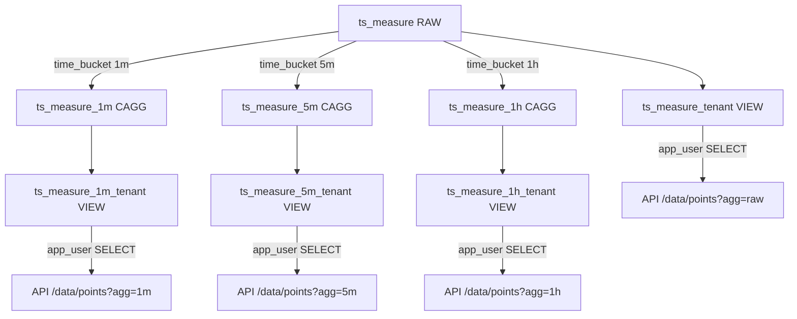

# 📚 Índice de Documentação - Fase R

**Fase R - Continuous Aggregates + Compressão**  
**Status**: ✅ COMPLETO  
**Data**: 2025-10-08

---

## 📋 Documentos Criados

### 1. **README_FASE_R.md** - Visão Geral Completa
📍 **Arquivo**: `traksense-backend/README_FASE_R.md`

**O que contém:**
- Resumo executivo da Fase R
- Arquitetura Opção B (VIEWs + GUC)
- Detalhes dos 3 CAGGs (1m/5m/1h)
- Modelo de segurança (VIEWs + security_barrier)
- Lista completa de migrations (0005-0028)
- Configuração do middleware Django
- Limitações conhecidas (RLS incompatível)
- Troubleshooting

**Quando usar**: Entender o que foi implementado e como funciona.

---

### 2. **docs/adr/004-views-guc-isolation.md** - Decisão Arquitetural
📍 **Arquivo**: `traksense-backend/docs/adr/004-views-guc-isolation.md`

**O que contém:**
- ADR (Architecture Decision Record) formal
- Contexto: Por que RLS não funciona com CAGGs
- Opção A (RLS) vs Opção B (VIEWs) vs Opção C (app manual)
- Trade-offs de cada opção
- Justificativa da escolha (Opção B)
- Implementação detalhada
- Consequências positivas/negativas
- Validação e testes

**Quando usar**: Entender **por quê** fizemos desta forma, não só **como**.

---

### 3. **VALIDATION_FASE_R.md** - Guia de Validação
📍 **Arquivo**: `traksense-backend/VALIDATION_FASE_R.md`

**O que contém:**
- Checklist de validação (11 pontos)
- SQL queries para verificar estado
- Verificar CAGGs criados
- Verificar VIEWs com security_barrier
- Verificar jobs TimescaleDB ativos
- Verificar GRANTs restritos
- Teste de isolamento com dados reais
- Troubleshooting de problemas comuns
- Testes de performance (opcional)

**Quando usar**: Validar que a implementação está correta após deploy.

---

### 4. **SUMMARY_FASE_R.md** - Resumo Executivo
📍 **Arquivo**: `traksense-backend/SUMMARY_FASE_R.md`

**O que contém:**
- Resumo executivo para não-técnicos
- O que foi feito (arquitetura, migrations)
- Números e métricas (antes vs depois)
- Objetivos alcançados (performance, storage, segurança)
- Decisões técnicas críticas
- Lições aprendidas
- Próximos passos

**Quando usar**: Apresentar resultados para stakeholders ou novos membros do time.

---

### 5. **NEXT_STEPS_API.md** - Guia de Implementação da API
📍 **Arquivo**: `traksense-backend/NEXT_STEPS_API.md`

**O que contém:**
- Roadmap de implementação (Fases S1-S4)
- **S1**: Middleware + GUC (código completo)
- **S2**: Models Django para VIEWs (código completo)
- **S3**: API /data/points (código completo)
- **S4**: Testes de integração
- Checklist de implementação
- Estimativa de tempo (6-9 horas)

**Quando usar**: Implementar a API que consome os CAGGs.

---

### 6. **INDEX_FASE_R.md** - Este Arquivo
📍 **Arquivo**: `traksense-backend/INDEX_FASE_R.md`

**O que contém:**
- Índice de toda a documentação criada
- Resumo de cada documento
- Fluxo de leitura recomendado
- Links rápidos

**Quando usar**: Navegar pela documentação da Fase R.

---

## 🗺️ Fluxo de Leitura Recomendado

### Para **Novos Membros do Time**:
1. 📖 **SUMMARY_FASE_R.md** - Entender o que foi feito (10 min)
2. 📖 **README_FASE_R.md** - Aprofundar na arquitetura (20 min)
3. 📖 **ADR-004** - Entender por quê (15 min)
4. ✅ **VALIDATION_FASE_R.md** - Validar ambiente local (15 min)

**Tempo total**: ~1 hora

---

### Para **Implementar a API**:
1. 📖 **README_FASE_R.md** - Entender CAGGs e VIEWs (20 min)
2. 🚀 **NEXT_STEPS_API.md** - Seguir guia passo a passo (6-9 horas)
3. ✅ **VALIDATION_FASE_R.md** - Validar funcionamento (30 min)

**Tempo total**: ~7-10 horas

---

### Para **Debugging/Troubleshooting**:
1. ✅ **VALIDATION_FASE_R.md** - Executar checklist de validação (15 min)
2. 📖 **README_FASE_R.md** - Seção "Troubleshooting" (5 min)
3. 📖 **ADR-004** - Entender decisões técnicas (10 min)

**Tempo total**: ~30 min

---

### Para **Apresentar para Stakeholders**:
1. 📖 **SUMMARY_FASE_R.md** - Resumo executivo completo (10 min)
2. 📊 Seção "Resultado em Números" - Métricas de impacto (5 min)

**Tempo total**: ~15 min

---

## 🔗 Links Rápidos

| Documento                  | Caminho                                           | Propósito                          |
|----------------------------|---------------------------------------------------|------------------------------------|
| README Fase R              | `traksense-backend/README_FASE_R.md`              | Visão geral + arquitetura          |
| ADR-004                    | `traksense-backend/docs/adr/004-views-guc-isolation.md` | Decisão arquitetural       |
| Validação                  | `traksense-backend/VALIDATION_FASE_R.md`          | Checklist de validação             |
| Resumo Executivo           | `traksense-backend/SUMMARY_FASE_R.md`             | Resultados + métricas              |
| Próximos Passos (API)      | `traksense-backend/NEXT_STEPS_API.md`             | Implementar API /data/points       |
| Este Índice                | `traksense-backend/INDEX_FASE_R.md`               | Navegação da documentação          |

---

## 📂 Estrutura de Arquivos

```
traksense-backend/
├── README_FASE_R.md                    ← Visão geral completa
├── SUMMARY_FASE_R.md                   ← Resumo executivo
├── VALIDATION_FASE_R.md                ← Guia de validação
├── NEXT_STEPS_API.md                   ← Guia de implementação API
├── INDEX_FASE_R.md                     ← Este arquivo (índice)
│
├── docs/
│   └── adr/
│       └── 004-views-guc-isolation.md  ← Decisão arquitetural
│
└── backend/
    └── apps/
        └── timeseries/
            └── migrations/
                ├── 0005_raw_no_compress_short_retention.py
                ├── 0006_cagg_1m_create.py
                ├── ...
                ├── 0027_tenant_scoped_views.py
                └── 0028_restrict_grants.py
```

---

## 🎯 Métricas de Documentação

| Métrica                          | Valor   |
|----------------------------------|---------|
| Documentos criados               | 6       |
| Páginas totais (estimado)        | ~40     |
| Tempo de leitura completa        | ~2h     |
| Migrations documentadas          | 24      |
| Exemplos de código               | 15+     |
| SQL queries para validação       | 11      |
| Troubleshooting scenarios        | 5       |

---

## ✅ Checklist de Documentação

- [x] **README principal** - Visão geral da implementação
- [x] **ADR-004** - Decisão arquitetural formal
- [x] **Guia de validação** - Checklist passo a passo
- [x] **Resumo executivo** - Para stakeholders
- [x] **Guia de implementação API** - Próximos passos
- [x] **Índice de documentação** - Este arquivo
- [ ] **ERD (Mermaid diagram)** - Visualização (pendente)
- [ ] **README DB troubleshooting** - Guia de operações (pendente)
- [ ] **Onboarding guide** - Para novos devs (pendente)

---

## 🚀 Próximas Documentações (Pendentes)

### 1. **ERD - Entity Relationship Diagram** (Mermaid)


### 2. **README_DB_OPERATIONS.md**
- Como verificar jobs do TimescaleDB
- Como forçar refresh manual de CAGGs
- Como monitorar compressão
- Como debugar problemas de GUC
- Como auditar acessos

### 3. **ONBOARDING_FASE_R.md**
- Guia para novos desenvolvedores
- Setup do ambiente local
- Convenções de código
- Como contribuir
- Troubleshooting comum

---

## 📞 Contato e Contribuições

**Autor**: TrakSense Backend Team  
**Última atualização**: 2025-10-08  
**Status**: ✅ COMPLETO

**Para reportar problemas ou sugerir melhorias**:
- Criar issue no repositório
- Mencionar "Fase R" no título
- Incluir link para este índice

---

**Fim do Índice - Fase R Documentação**
