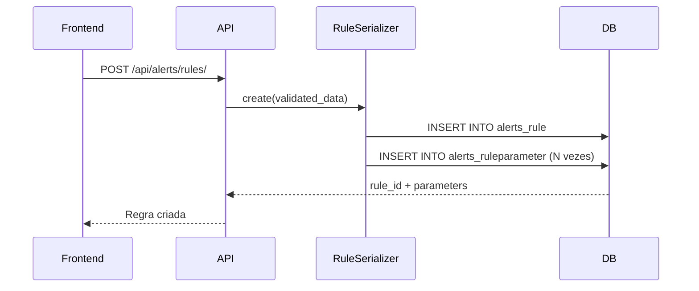
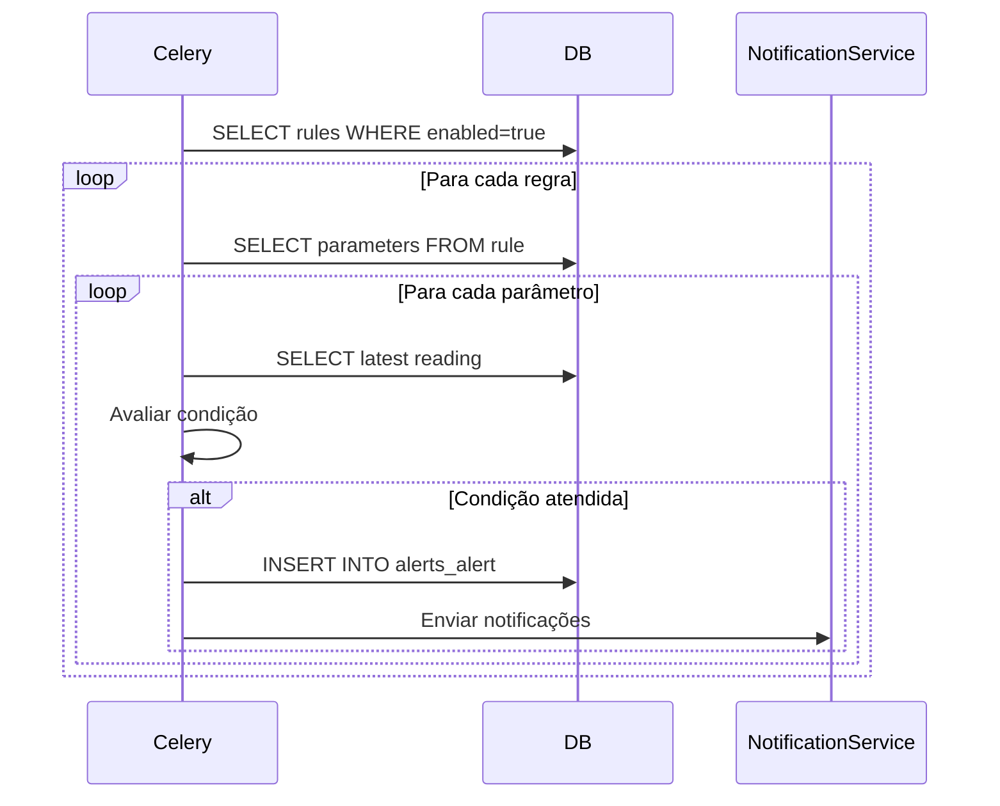
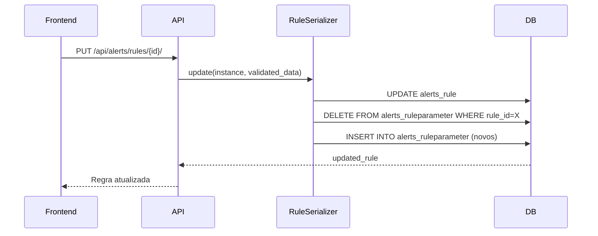

# Implementação Completa: Múltiplos Parâmetros por Regra

## 📋 Resumo Executivo

Implementação completa do sistema de múltiplos parâmetros por regra de alerta, permitindo que uma única regra monitore vários sensores simultaneamente.

**Status:** ✅ **IMPLEMENTADO**  
**Data:** 30/10/2025  
**Versão:** 1.0.0

---

## 🎯 Objetivo

Permitir que uma regra de alerta possa monitorar **múltiplos sensores** do mesmo equipamento, cada um com suas próprias condições, thresholds e mensagens personalizadas.

### Exemplo de Uso

**Antes (formato antigo):**
```json
{
  "name": "Temperatura Alta",
  "equipment": 123,
  "parameter_key": "sensor_temp_01",
  "operator": ">",
  "threshold": 25,
  "severity": "High"
}
```

**Depois (formato novo):**
```json
{
  "name": "Monitoramento Completo",
  "equipment": 123,
  "parameters": [
    {
      "parameter_key": "sensor_temp_01",
      "operator": ">",
      "threshold": 25,
      "severity": "High",
      "message_template": "Temperatura de {value}°C ultrapassou {threshold}°C"
    },
    {
      "parameter_key": "sensor_humidity_01",
      "operator": ">",
      "threshold": 80,
      "severity": "Medium",
      "message_template": "Umidade de {value}% ultrapassou {threshold}%"
    }
  ]
}
```

---

## 🏗️ Arquitetura

### Estrutura de Dados

```
Rule (1) -----> (N) RuleParameter
  ↓                     ↓
Equipment         Sensor/Threshold/Condition
```

### Modelo de Dados

#### `RuleParameter` (Novo)
```python
class RuleParameter(models.Model):
    rule = ForeignKey(Rule)
    parameter_key = CharField()      # ID do sensor
    variable_key = CharField()       # Tipo do sensor
    operator = CharField()           # >, <, >=, <=, ==, !=
    threshold = FloatField()         # Valor limite
    unit = CharField()               # Unidade (°C, %, etc)
    duration = IntegerField()        # Cooldown em minutos
    severity = CharField()           # Critical, High, Medium, Low
    message_template = TextField()   # Template com {variáveis}
    order = IntegerField()          # Ordem de exibição
```

#### `Rule` (Atualizado)
- Campos antigos marcados como **deprecated** (nullable)
- Novo relacionamento: `parameters` (reverse FK)
- Compatibilidade mantida com regras antigas

---

## 📦 Componentes Implementados

### 1. Backend - Models (`apps/alerts/models.py`)

#### RuleParameter
```python
class RuleParameter(models.Model):
    """Parâmetro individual de uma regra - permite múltiplos parâmetros"""
    rule = models.ForeignKey('Rule', related_name='parameters')
    parameter_key = models.CharField(max_length=100)
    operator = models.CharField(max_length=10, choices=OPERATOR_CHOICES)
    threshold = models.FloatField()
    severity = models.CharField(max_length=20, choices=SEVERITY_CHOICES)
    message_template = models.TextField()
    # ... outros campos
```

**Tabela:** `alerts_ruleparameter`  
**Índices:**
- `(rule_id, order)` - Para ordenação
- `(parameter_key)` - Para buscas

### 2. Backend - Serializers (`apps/alerts/serializers.py`)

#### RuleParameterSerializer
```python
class RuleParameterSerializer(serializers.ModelSerializer):
    class Meta:
        model = RuleParameter
        fields = ['id', 'parameter_key', 'operator', 'threshold', ...]
```

#### RuleSerializer (Atualizado)
```python
class RuleSerializer(serializers.ModelSerializer):
    parameters = RuleParameterSerializer(many=True, required=False)
    
    def create(self, validated_data):
        parameters_data = validated_data.pop('parameters', [])
        rule = Rule.objects.create(**validated_data)
        
        for idx, param_data in enumerate(parameters_data):
            param_data['order'] = idx
            RuleParameter.objects.create(rule=rule, **param_data)
        
        return rule
```

**Features:**
- ✅ Nested serializer para `parameters`
- ✅ Criação automática de parâmetros
- ✅ Atualização com delete/recreate
- ✅ Compatibilidade com formato antigo

### 3. Backend - Tasks (`apps/alerts/tasks.py`)

#### Avaliação de Regras
```python
def evaluate_single_rule(rule):
    """Avalia múltiplos parâmetros de uma regra"""
    parameters = rule.parameters.all()
    
    for param in parameters:
        # Check cooldown por parâmetro
        # Buscar telemetria
        # Avaliar condição
        # Criar alerta se necessário
```

**Features:**
- ✅ Suporta múltiplos parâmetros
- ✅ Cooldown independente por parâmetro
- ✅ Mensagens personalizadas com templates
- ✅ Fallback para formato antigo (`evaluate_single_rule_legacy`)

#### Templates de Mensagem
```python
def generate_alert_message_from_template(template, param, reading, value):
    """Substitui variáveis no template"""
    message = template
    message = message.replace('{sensor}', param.parameter_key)
    message = message.replace('{value}', str(value))
    message = message.replace('{threshold}', str(param.threshold))
    message = message.replace('{operator}', operator_map[param.operator])
    message = message.replace('{unit}', param.unit)
    return message
```

**Variáveis suportadas:**
- `{sensor}` - Nome/ID do sensor
- `{value}` - Valor atual
- `{threshold}` - Valor limite
- `{operator}` - Operador em texto
- `{unit}` - Unidade de medida

### 4. Backend - Admin (`apps/alerts/admin.py`)

```python
class RuleParameterInline(admin.TabularInline):
    model = RuleParameter
    extra = 1
    fields = ['parameter_key', 'operator', 'threshold', 'severity', ...]

@admin.register(Rule)
class RuleAdmin(admin.ModelAdmin):
    inlines = [RuleParameterInline]
    list_display = ['name', 'equipment', 'parameters_count', ...]
```

**Features:**
- ✅ Inline editor para parâmetros
- ✅ Contador de parâmetros na listagem
- ✅ Campos antigos colapsados como "deprecated"

### 5. Frontend - AddRuleModalMultiParam

**Arquivo:** `src/components/alerts/AddRuleModalMultiParam.tsx`

#### Features Principais
- ✅ Interface para múltiplos parâmetros
- ✅ Design com glassmorphism
- ✅ Cards individualizados por parâmetro
- ✅ Seletor de sensor dinâmico
- ✅ Template de mensagem com preview de variáveis
- ✅ Validação completa antes de salvar
- ✅ Auto-preenchimento de `variable_key` e `unit`

#### Estrutura de Dados Enviada
```typescript
const ruleData = {
  name: string,
  description: string,
  equipment: number,
  parameters: [
    {
      parameter_key: string,
      variable_key: string,
      operator: Operator,
      threshold: number,
      unit: string,
      duration: number,
      severity: Severity,
      message_template: string,
    }
  ],
  actions: NotificationAction[],
  enabled: boolean,
};
```

---

## 🔄 Fluxo de Funcionamento

### 1. Criação de Regra



### 2. Avaliação de Regra (Celery Task)



### 3. Edição de Regra



---

## 🔀 Compatibilidade

### Formato Antigo (Deprecated)

Regras criadas com o formato antigo **continuam funcionando**:

```python
# Campos antigos em Rule
parameter_key = CharField(blank=True, null=True)
operator = CharField(blank=True, null=True)
threshold = FloatField(blank=True, null=True)
# ...
```

### Migração Automática

O serializer converte automaticamente:

```python
def create(self, validated_data):
    parameters_data = validated_data.pop('parameters', [])
    
    # Se não veio parameters mas veio campos antigos
    if not parameters_data and validated_data.get('parameter_key'):
        parameters_data = [{
            'parameter_key': validated_data.get('parameter_key'),
            'operator': validated_data.get('operator'),
            # ... outros campos
        }]
```

---

## 🧪 Testes

### Quando o Banco Estiver Online

#### 1. Aplicar Migration
```bash
cd traksense-backend
python manage.py migrate alerts
```

**Saída esperada:**
```
Running migrations:
  Applying alerts.0002_alter_rule_duration_alter_rule_operator... OK
```

#### 2. Criar Regra via API
```bash
POST /api/alerts/rules/
{
  "name": "Teste Multi-Parâmetro",
  "equipment": 1,
  "parameters": [
    {
      "parameter_key": "sensor_1",
      "operator": ">",
      "threshold": 25,
      "severity": "High",
      "message_template": "Sensor {sensor} em {value}°C (limite: {threshold}°C)"
    }
  ],
  "actions": ["EMAIL", "IN_APP"]
}
```

#### 3. Verificar Admin Django
- Acessar `/admin/alerts/rule/`
- Ver inline de parâmetros
- Editar e adicionar múltiplos parâmetros

#### 4. Testar Avaliação (Celery)
```bash
python manage.py shell
>>> from apps.alerts.tasks import evaluate_rules_task
>>> evaluate_rules_task()
```

---

## 📊 Métricas e Performance

### Impacto em Database

**Antes:**
- 1 query para buscar regra
- 1 query para buscar leitura
- Total: **2 queries por regra**

**Depois:**
- 1 query para buscar regra
- 1 query para buscar parâmetros (prefetch)
- N queries para buscar leituras (uma por parâmetro)
- Total: **2 + N queries por regra**

### Otimização Implementada

```python
rules = Rule.objects.filter(enabled=True).prefetch_related('parameters')
```

Reduz queries de `1 + N` para `2` (regras + parâmetros em bulk).

---

## 🔒 Validações

### Frontend
- ✅ Nome da regra obrigatório
- ✅ Equipamento obrigatório
- ✅ Pelo menos 1 parâmetro
- ✅ Sensor selecionado em cada parâmetro
- ✅ Mensagem personalizada obrigatória
- ✅ Pelo menos 1 ação selecionada

### Backend
- ✅ `duration` > 0
- ✅ `threshold` deve ser número
- ✅ `actions` deve ser lista válida
- ✅ `operator` deve estar em OPERATOR_CHOICES
- ✅ `severity` deve estar em SEVERITY_CHOICES

---

## 📚 Documentação Adicional

### Variáveis de Template

| Variável | Descrição | Exemplo |
|----------|-----------|---------|
| `{sensor}` | ID/nome do sensor | `sensor_temp_01` |
| `{value}` | Valor atual lido | `27.5` |
| `{threshold}` | Valor limite configurado | `25.0` |
| `{operator}` | Operador em texto | `maior que` |
| `{unit}` | Unidade de medida | `°C` |

### Exemplos de Templates

```
"Temperatura de {value}{unit} ultrapassou o limite de {threshold}{unit}"
→ "Temperatura de 27.5°C ultrapassou o limite de 25.0°C"

"{sensor} está {operator} {threshold}{unit} (atual: {value}{unit})"
→ "sensor_temp_01 está maior que 25.0°C (atual: 27.5°C)"
```

---

## 🚀 Próximos Passos

### Melhorias Futuras

1. **Lógica Combinada** (AND/OR)
   - Disparar alerta apenas quando TODOS os parâmetros violarem (AND)
   - Disparar alerta quando QUALQUER parâmetro violar (OR)

2. **Histórico de Parâmetros**
   - Manter histórico de mudanças nos parâmetros
   - Auditoria completa

3. **Templates Pré-definidos**
   - Biblioteca de templates comuns
   - Sugestões baseadas no tipo de sensor

4. **Visualização**
   - Dashboard mostrando parâmetros monitorados
   - Gráficos de tendência por parâmetro

---

## 🐛 Troubleshooting

### Erro: "parameters não definido"
**Solução:** Aplicar migration 0002
```bash
python manage.py migrate alerts
```

### Regras antigas não aparecem
**Solução:** Regras antigas são automaticamente convertidas. Verificar se `parameter_key` está preenchido.

### Alerta não dispara
**Checklist:**
1. Regra está `enabled=True`?
2. Parâmetros estão cadastrados?
3. Telemetria está chegando para o sensor?
4. Cooldown já passou?
5. Task do Celery está rodando?

---

## ✅ Checklist de Implementação

- [x] Modelo `RuleParameter` criado
- [x] Migration gerada
- [x] Serializer com nested parameters
- [x] Task de avaliação atualizada
- [x] Admin com inline
- [x] Frontend atualizado
- [x] Compatibilidade mantida
- [x] Validações implementadas
- [x] Templates de mensagem
- [ ] Migration aplicada (aguardando BD online)
- [ ] Testes E2E

---

## 📞 Suporte

Para dúvidas ou problemas:
1. Verificar este documento
2. Checar logs do Celery
3. Validar migration foi aplicada
4. Testar no Django Admin primeiro

---

**Implementado por:** GitHub Copilot  
**Data:** 30/10/2025  
**Versão Backend:** Django 5.x  
**Versão Frontend:** React 19 + TypeScript
